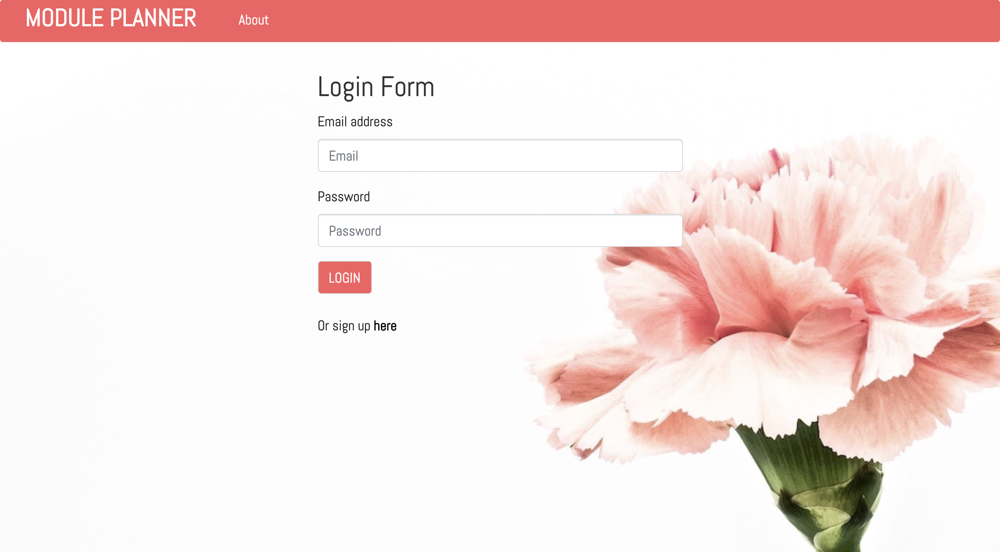
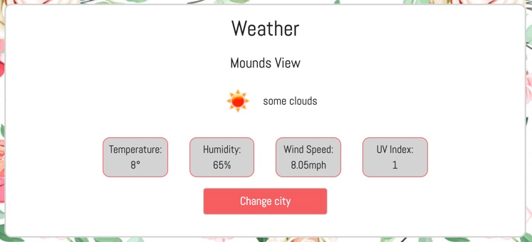
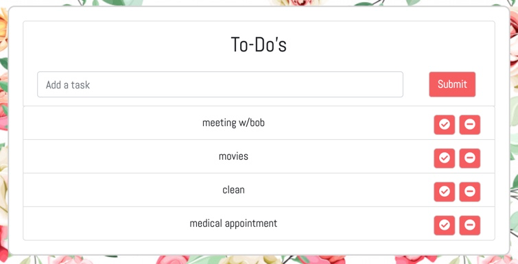
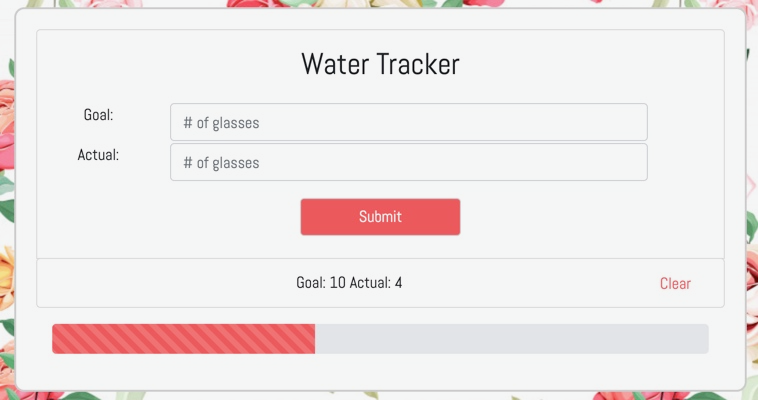
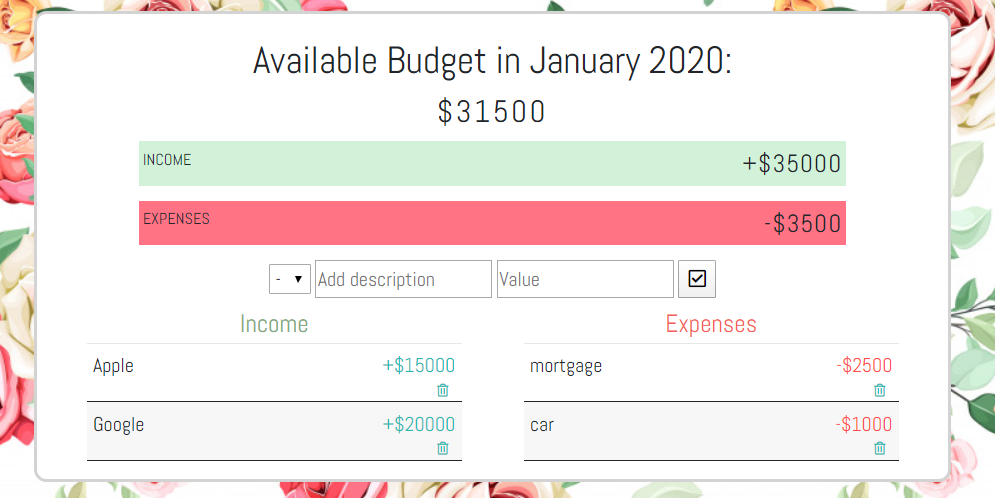

# module_planner

## Project 2: Module Planner

Module Planner is a friendly planner application for users who are looking to become more organized.

What it does:
- Allows you to create a user account and add your city.
- Displays the current date as well as the weather of your city.
- Allows you to create a to-do list where you can mark tasks as completed and delete them.
- Allows you to create a water goal and update it throughout the day.
- Allows you to create a budget to keep track of your finances.
- All of these features are viewed on one page for increased productivity.
- Information are stored on a database so you don't lose any data.

Click here to try ['Module Planner'](https://moduleplanner2020.herokuapp.com/members)!

## Screenshots:

## Authors
- [Ashley Wegwerth](https://github.com/Ashleyw27)
- [Haylee Thomas-Kuhlman](https://github.com/haylee430)
- [Ka Vang](https://github.com/ka-vang)
- [Mai Xiong](https://github.com/maixiong29)
